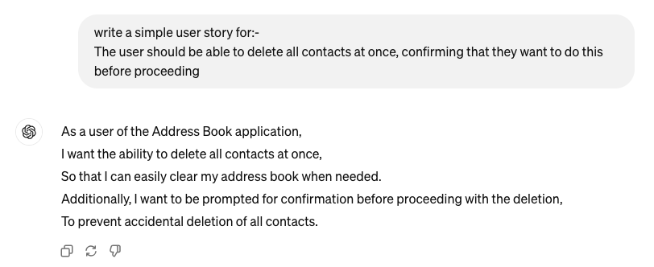
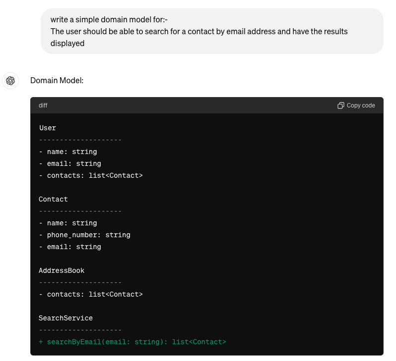
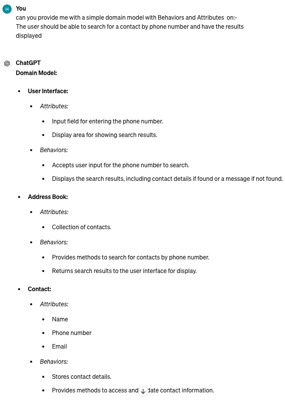
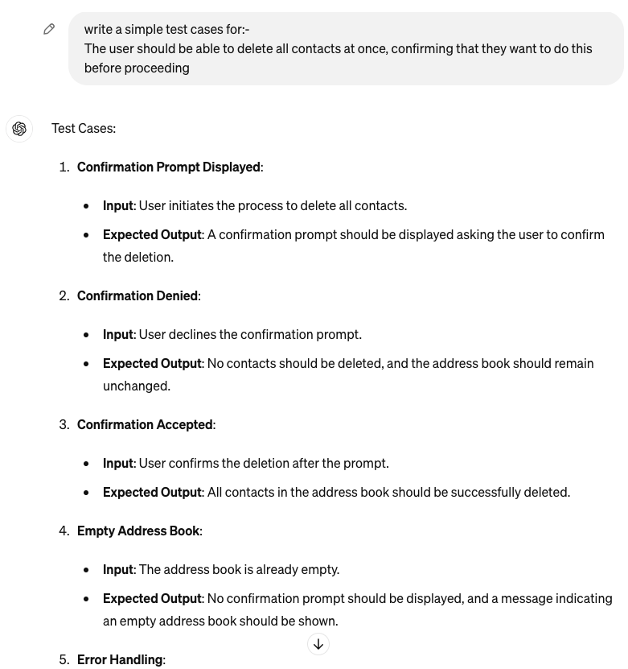

### Chat gpt:-

#### Domain models for simple user stories using Generative AI tool

  
  

  
  

  
  
  

  
  
  

#### Tests using Generative AI tool. Test cases and/or code for tests

  
  
  
  
   

#### Refactor code using Generative AI tool to make it more efficient

  
  
  
  
   

#### Refactor code using Generative AI tool to make it more efficient

