# Domain Models, Class Diagrams and Test Plan

## Task 2 and Task 3

### User Stories and Domain Models

#### User story 1:-

As a user, <br>
I want to be able to add a contact to the address book (name, phone number and email address), <br>
So that I can save the contact for future use. <br>

|   Object    |                          Properties                           |        Messages         | Output |
| :---------: | :-----------------------------------------------------------: | :---------------------: | :----: |
| AddressBook |                 contacts @ArrayList<Contact>                  |  addContact(@Contact)   | @void  |
|   Contact   |                         name @String                          |    setName(@String)     | @void  |
|             |                         email @String                         |    setEmail(@String)    | @void  |
|             |                      phoneNumber @String                      | setPhoneNumber(@String) | @void  |
|             |                            id @int                            |                         |        |
|             | constructor(name @String, email @String, phoneNumber @String) |                         | @void  |

##### Test Cases:-
- addContact() should add an entry to the contact arraylist<>.
- When addContact() is called, the length of the contacts array should increase by 1.
- After adding a contact, the latest contact in the array should be the one you just added.
- The addContact() function should not allow null values.
- Contact is not added if phone number exist in the address book (duplicate phone numbers).
- Contact is not added if email  exist in the address book (duplicate email addresses).
- Contact is not added even if email is a duplicate with different capitalization.


#### User story 2:-

As a user, <br>
I want to be able to search for a contact by name, <br>
So that I can save time finding the contact. <br>

|   Object    |                          Properties                           |       Messages        |       Output        |
| :---------: | :-----------------------------------------------------------: | :-------------------: | :-----------------: |
| AddressBook |                 contacts @ArrayList<Contact>                  | searchByName(@String) | @ArrayList<Contact> |
|   Contact   |                         name @String                          |       getName()       |       @String       |
|             |                         email @String                         |      getEmail()       |       @String       |
|             |                      phoneNumber @String                      |   getPhoneNumber()    |       @String       |
|             |                            id @int                            |                       |        @int         |
|             | constructor(name @String, email @String, phoneNumber @String) |                       |        @void        |

##### Test Cases:-
- searchContacts() should display the correct contact when the name is entered.
- If you type in a name that doesn't match any contact, it will give an error message.
- It should find contacts regardless of whether the name is in uppercase or lowercase.
- If you enter empty string, it will give an error message.
- Even if you only type in part of a name, it should still find the right contacts.


#### User story 3:-

As a user, <br>
I want to be able to remove a contact from the address book, <br>
So that I can the address book does not contain unnecessary contacts. <br>

|   Object    |                          Properties                           |      Messages       | Output  |
| :---------: | :-----------------------------------------------------------: | :-----------------: | :-----: |
| AddressBook |                 contacts @ArrayList<Contact>                  | removeContact(@int) |  @void  |
|   Contact   |                         name @String                          |      getName()      | @String |
|             |                         email @String                         |     getEmail()      | @String |
|             |                      phoneNumber @String                      |  getPhoneNumber()   | @String |
|             |                            id @int                            |                     |         |
|             | constructor(name @String, email @String, phoneNumber @String) |                     |  @void  |

##### Test Cases:-
- The length of the contacts array should decrease by 1 (When removeContact() is called).
- Once you delete a contact, you shouldn't be able to find it anymore when searching for contacts.
- If you try to delete a contact with a Phone number that doesn't exist, you'll get an error message.

#### User story 4:-

As a user, <br>
I want to be able to edit contact details, <br>
So that I can keep the contact information up to date. <br>

|   Object    |                          Properties                           |                   Messages                   | Output |
| :---------: | :-----------------------------------------------------------: | :------------------------------------------: | :----: |
| AddressBook |                 contacts @ArrayList<Contact>                  | editContact(@int, @String, @String, @String) | @void  |
|   Contact   |                         name @String                          |               setName(@String)               | @void  |
|             |                         email @String                         |              setEmail(@String)               | @void  |
|             |                      phoneNumber @String                      |           setPhoneNumber(@String)            | @void  |
|             |                            id @int                            |                                              |        |
|             | constructor(name @String, email @String, phoneNumber @String) |                                              | @void  |

##### Test Cases:-
- You can use editContact() to update various fields of the contact, including name, email, and phone number.
- If you try to edit a contact with an ID that doesn't exist, you'll receive an error message.
- If the phone number provided to editContact already exists in the address book, the contact should not be updated and give a message.
- Similarly, if the email passed to editContact already exists in the address book, the contact should not be updated and give a message.

#### User story 5:-

As a user, <br>
I want the software to prevent me from adding contacts that already exists in the address book, <br>
So that I can avoid having duplicate contacts. <br>

|   Object    |                          Properties                           |                   Messages                   |  Output  |
| :---------: | :-----------------------------------------------------------: | :------------------------------------------: | :------: |
| AddressBook |                 contacts @ArrayList<Contact>                  |             addContact(@Contact)             |  @void   |
|             |                                                               | editContact(@int, @String, @String, @String) |  @void   |
|             |                                                               |      phoneNumberAlreadyExists(@String)       | @boolean |
|             |                                                               |         emailAlreadyExists(@String)          | @boolean |
|   Contact   |                         name @String                          |                  getName()                   | @String  |
|             |                         email @String                         |                  getEmail()                  | @String  |
|             |                      phoneNumber @String                      |               getPhoneNumber()               | @String  |
|             |                            id @int                            |                                              |   @int   |
|             | constructor(name @String, email @String, phoneNumber @String) |                                              |  @void   |

##### Test Cases:-
- In addContact(), if the provided phone number or email already exists in the address book, the entry should be rejected.
- addContact() should still accept an entry that matches a previous entry that was deleted from the address book.
- When using editContact(), any changes that would result in a duplicate email or phone number in the address book should be rejected.


#### User story 6:-

As a user, <br>
I want to be able to view all contacts in the address book, <br>
So that I can view all saved contacts. <br>

|   Object    |          Properties          |    Messages    |       Output        |
| :---------: | :--------------------------: | :------------: | :-----------------: |
| AddressBook | contacts @ArrayList<Contact> | viewContacts() | @ArrayList<Contact> |

##### Test Cases:-
-  getAllContacts() should retrieve and return all contacts currently stored in the address book.
-  Whenever a contact is added, removed, or edited, getAllContacts() should update accordingly to reflect the changes.
-  If there are no contacts in the address book, getAllContacts() should return an error message.

#### User story 7:-

As a user, <br>
I want to be able to use the console interface to interact with the software, <br>
So that I can see my results by using the software. <br>

| Object | Properties | Messages | Output |
| :----: | :--------: | :------: | :----: |
|  App   |            |  main()  | @void  |

##### Test Cases:-
- When the user chooses to add a contact from the menu, the addContact() function should be triggered.
- If the user opts to search for a contact from the menu and inputs the name, the searchByName() function should be invoked.
- When the user selects to remove a contact from the menu and inputs the name, the removeContact() function should be invoked.
- If the user selects to edit a contact from the menu and inputs the new details, the editContact() function should be called.
- When the user selects to view contacts from the menu, the viewContacts() function should be executed.

### Additional Features
Generative AI has been used to help write the following user stories and domain models.

#### User story 8:-

##### Chat gpt:-
<p float="left">
  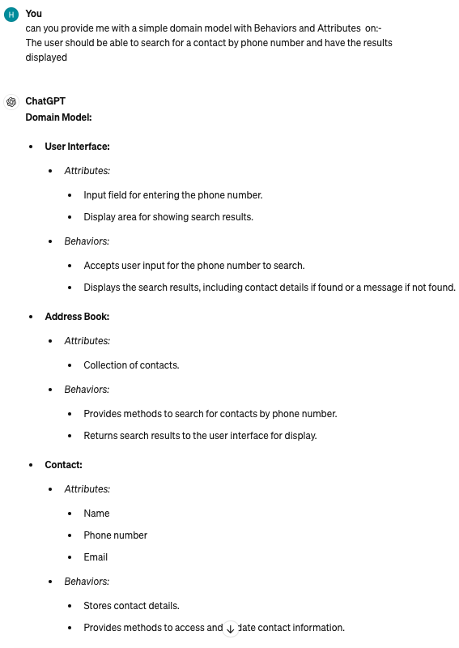
  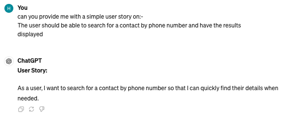
  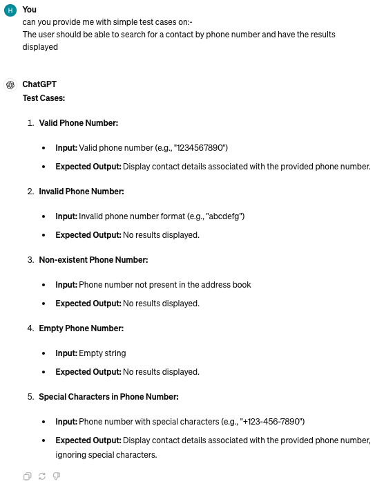
</p>


As a user, <br>
I want to search for a contact by phone number, <br>
So that I can quickly find their details when needed. <br>

|   Object    |                          Properties                           |        Messages        |       Output        |
| :---------: | :-----------------------------------------------------------: | :--------------------: | :-----------------: |
| AddressBook |                 contacts @ArrayList<Contact>                  | searchByPhone(@String) | @ArrayList<Contact> |
|   Contact   |                         name @String                          |       getName()        |       @String       |
|             |                         email @String                         |       getEmail()       |       @String       |
|             |                      phoneNumber @String                      |    getPhoneNumber()    |       @String       |
|             |                            id @int                            |                        |        @int         |
|             | constructor(name @String, email @String, phoneNumber @String) |                        |        @void        |

##### Test Cases:-
- Valid Phone Number
- Invalid Phone Number
- Non-existent Phone Number
- Empty Phone Number

#### User story 9:-

##### Chat gpt:-
<p float="left">
  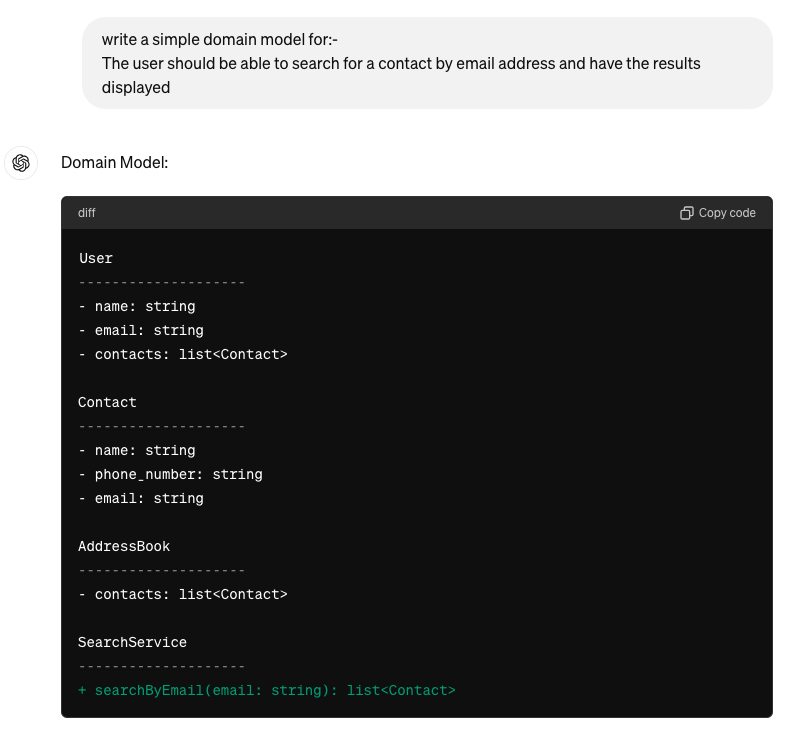
  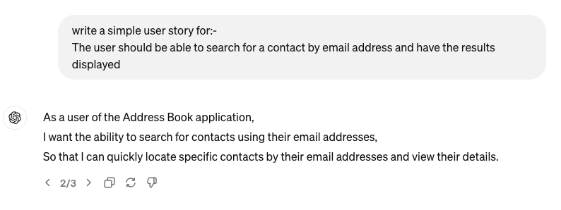
  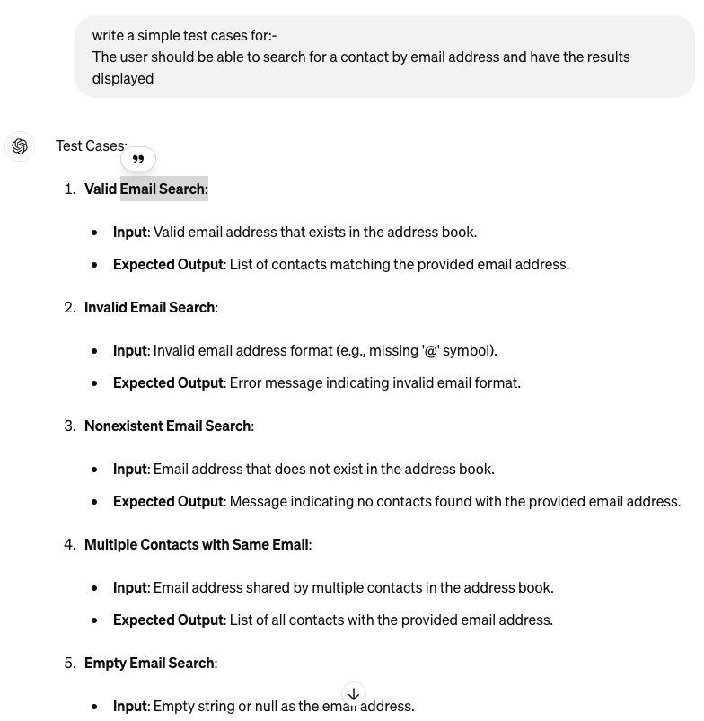
</p>


As a user of the Address Book application, <br>
I want the ability to search for contacts using their email addresses, <br>
So that I can quickly locate specific contacts by their email addresses and view their details. <br>

|   Object    |                          Properties                           |        Messages        |       Output        |
| :---------: | :-----------------------------------------------------------: | :--------------------: | :-----------------: |
| AddressBook |                 contacts @ArrayList<Contact>                  | searchByEmail(@String) | @ArrayList<Contact> |
|   Contact   |                         name @String                          |       getName()        |       @String       |
|             |                         email @String                         |       getEmail()       |       @String       |
|             |                      phoneNumber @String                      |    getPhoneNumber()    |       @String       |
|             |                            id @int                            |                        |        @int         |
|             | constructor(name @String, email @String, phoneNumber @String) |                        |        @void        |

##### Test Cases:-
- Valid Email Search
- Invalid Email Search
- Non-existent Email 
- Empty Email Search

#### User story 10:-

##### Chat gpt:-
<p float="left">
  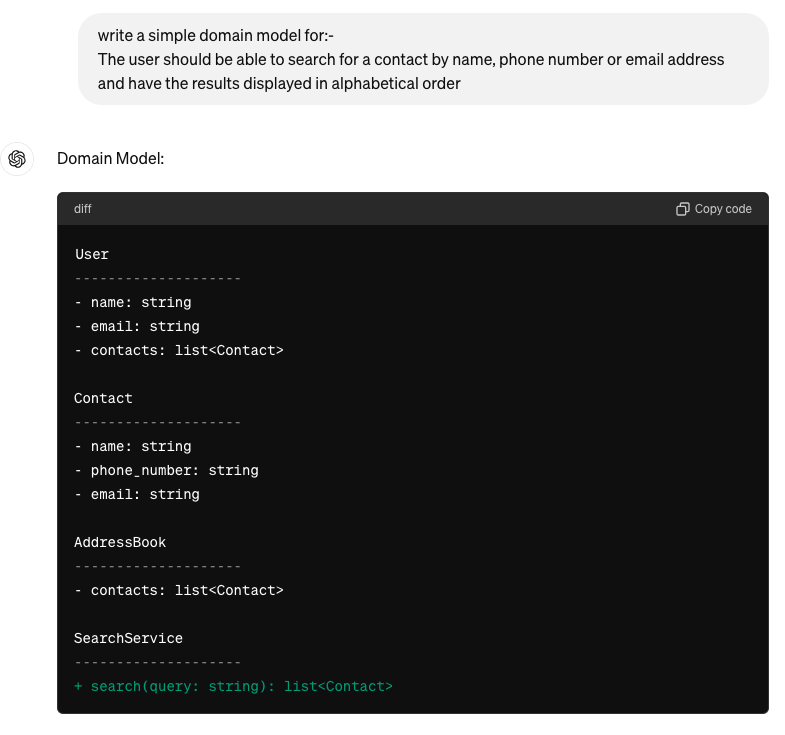
  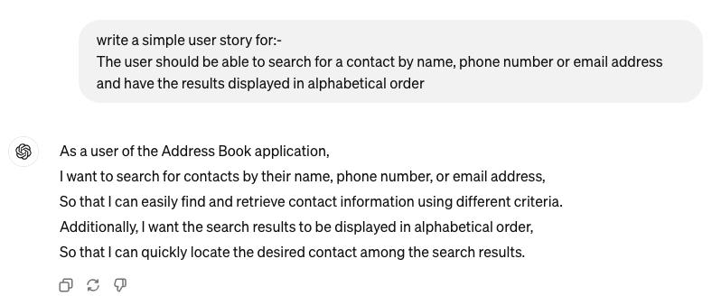
  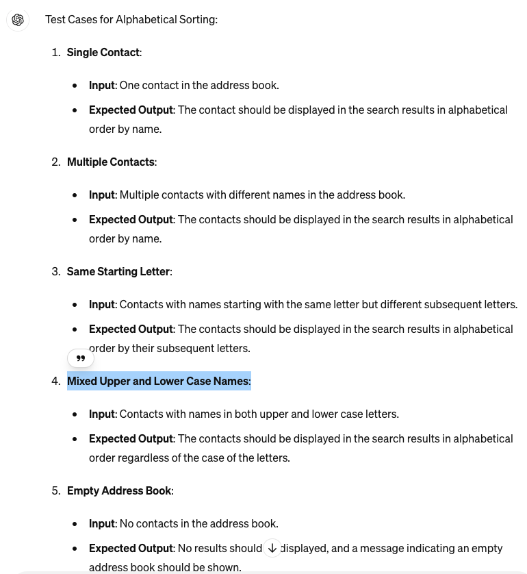
</p>


As a user of the Address Book application,
<br>I want to search for contacts by their name, phone number, or email address,
<br>So that I can easily find and retrieve contact information using different criteria.
<br>Additionally, I want the search results to be displayed in alphabetical order,
<br>So that I can quickly locate the desired contact among the search results.

|   Object    |                          Properties                           |        Messages        |       Output        |
| :---------: | :-----------------------------------------------------------: | :--------------------: | :-----------------: |
| AddressBook |                 contacts @ArrayList<Contact>                  | searchService(@String) | @ArrayList<Contact> |
|   Contact   |                         name @String                          |       getName()        |       @String       |
|             |                         email @String                         |       getEmail()       |       @String       |
|             |                      phoneNumber @String                      |    getPhoneNumber()    |       @String       |
|             |                            id @int                            |                        |        @int         |
|             | constructor(name @String, email @String, phoneNumber @String) |                        |        @void        |

##### Test Cases:-
- Valid Single Contact
- Invalid Multiple Contacts
- Same Starting Letter
- Mixed Upper and Lower Case Names

#### User story 11:-

##### Chat gpt:-
<p float="left">
  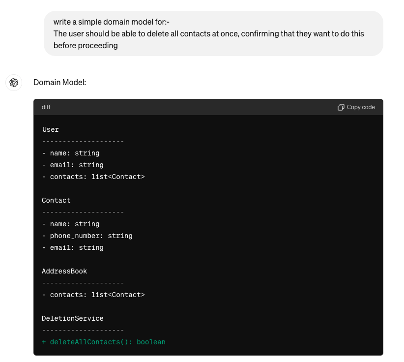
  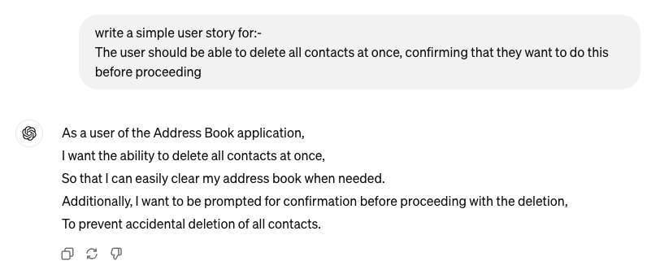
  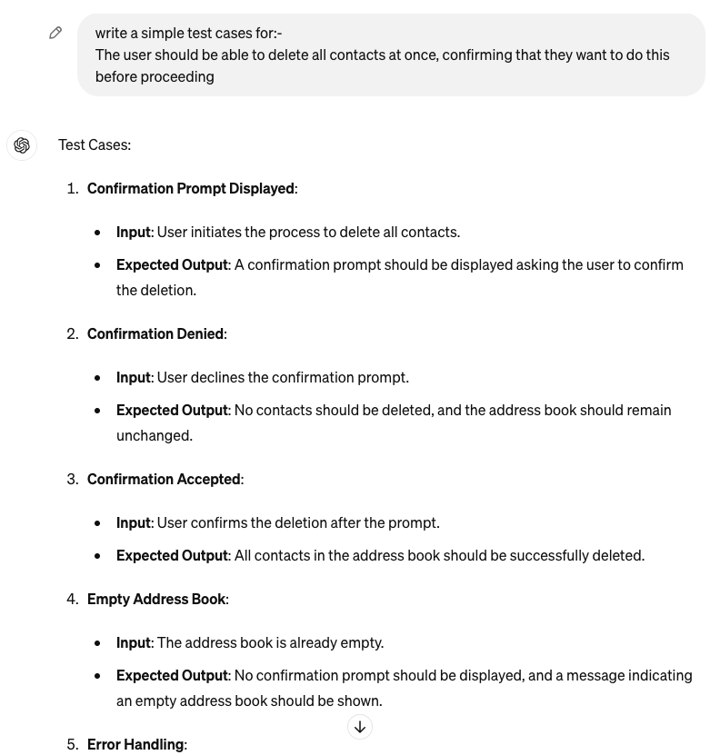
</p>


<br>As a user of the Address Book application,
<br>I want the ability to delete all contacts at once,
<br>So that I can easily clear my address book when needed.
<br>Additionally, I want to be prompted for confirmation before proceeding with the deletion,
<br>To prevent accidental deletion of all contacts.

|   Object    |          Properties          |     Messages      | Output |
| :---------: | :--------------------------: | :---------------: | :----: |
| AddressBook | contacts @ArrayList<Contact> | deletionService() | @void  |


##### Test Cases:-
- Confirmation Prompt Displayed
- Confirmation Denied
- Confirmation Accepted
- Empty Address Book


### Class Diagram
```mermaid
classDiagram

 class AddressBook {
  - List<Contact> contactList
  + addContact(Contact contact): void
  + getContacts(): ArrayList<Contact> 
  + getContactId(id: int): Contact
  + phoneNumberAlreadyExists(id: int, phoneNumber: String): boolean 
  + emailAlreadyExists(id: int, email: String): boolean 
  + phoneNumberAlreadyExists(phoneNumber: String): boolean 
  + emailAlreadyExists(email: String): boolean          
  + removeContact(id: int): void                        
  + searchByName(name: String): void      
  - SortByName(name: String): ArrayList<Contact> (private)              
  + searchByPhoneNumber(phoneNumber: String): void      
  + searchByEmail(email: String): void                  
  + editContact(id: int, newName: String, newEmail: String, newPhoneNumber: String): void 
  + viewContacts(): String                              
  + deletionService(): void                             
 }
 
  class Contact {
 - id: int              
 - email: String        
 - name: String         
 - phoneNumber: String  
 - idUnique: AtomicInteger (static) 
 + Contact(name: String, email: String, phoneNumber: String) 
 + Contact()             
 + getId(): int          
 + setId(id: int): void  
 + getEmail(): String    
 + setEmail(email: String): void 
 + getName(): String     
 + setName(name: String): void 
 + getPhoneNumber(): String 
 + setPhoneNumber(phoneNumber: String): void 
 + validateName(name: String): void (static) 
 + validateEmail(email: String): void (static) 
 + validatePhoneNumber(phoneNumber: String): void (static) 
    }

 class App {
 + main(String[] args): void 
 + showMenu(): void          
 + enterKey(): void          
 + loadContacts(AddressBook): void 
 - addContact(Scanner, AddressBook): void 
 - editContact(Scanner, AddressBook): void 
 - searchContact(Scanner, AddressBook): void 
 - removeContact(Scanner, AddressBook): void 
 - viewAllContacts(AddressBook): void 
 - deleteAllContacts(Scanner, AddressBook): void 
    }


